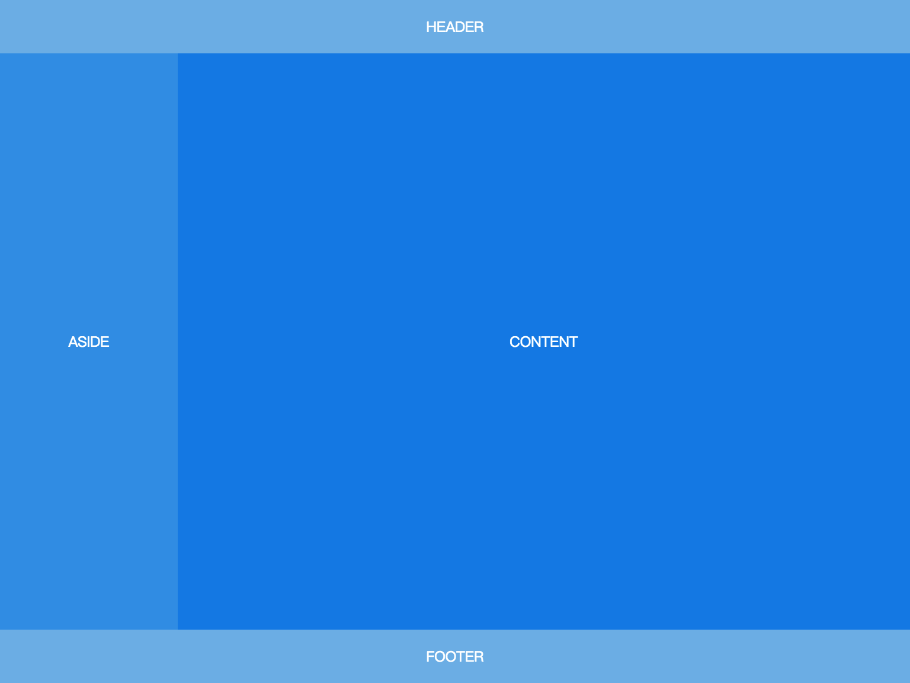
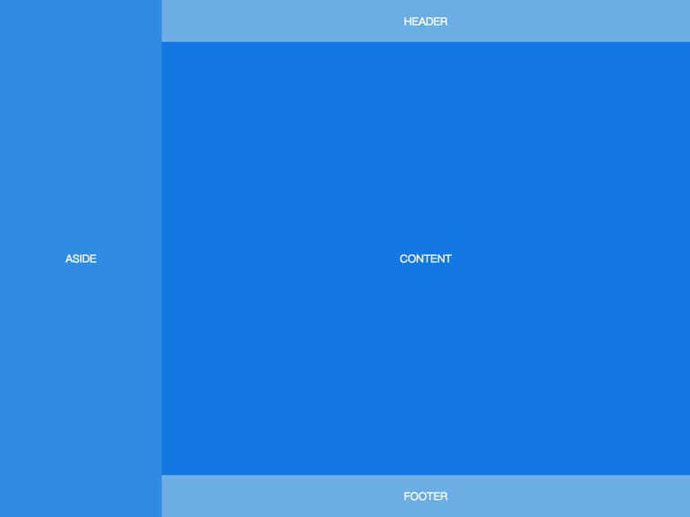
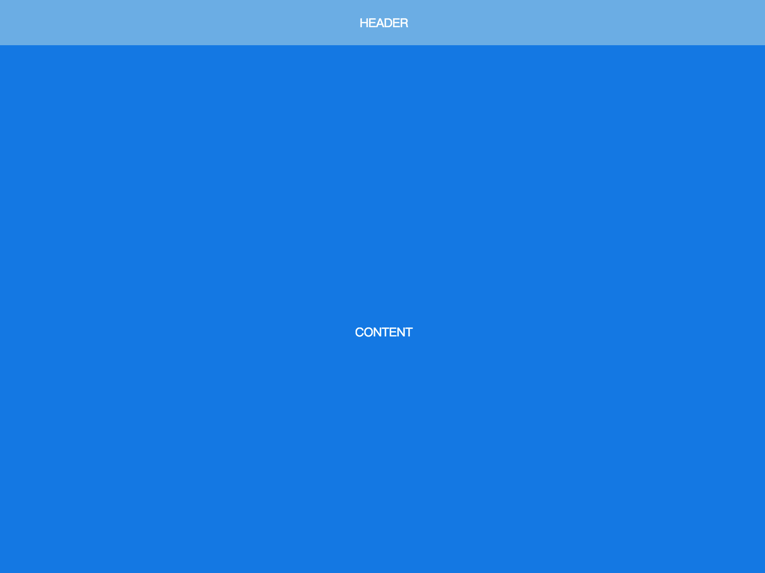
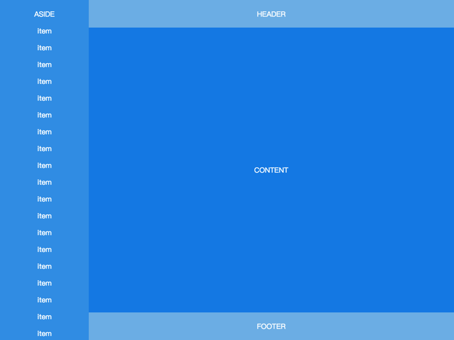

# Flex Layout

## Sticky Footer

[demo link](./demos/1.html)


```html
<body>
  <header>HEADER</header>
  <article>CONTENT</article>
  <footer>FOOTER</footer>
</body>
```

```css
body {
  min-height: 100vh;
  display: flex;
  flex-direction: column;
}
article {
  flex: auto;
}
```

## Fixed-Width Sidebar

[demo link](./demos/2.html)



```html
<body>
  <header>HEADER</header>
  <div class="content">
    <aside>ASIDE</aside>
    <article>CONTENT</article>
  </div>
  <footer>FOOTER</footer>
</body>
```

```css
body {
  min-height: 100vh;
  display: flex;
  flex-direction: column;
}
.content {
  flex: auto;
  display: flex;
}
.content article {
  flex: auto;
}
```

## 左右布局

[demo link](./demos/3.html)



```html
<body>
  <aside>ASIDE</aside>
  <div class="content">
    <header>HEADER</header>
    <article>CONTENT</article>
    <footer>FOOTER</footer>
  </div>
</body>
```

```css
body {
  min-height: 100vh;
  display: flex;
}
aside {
  flex: none;
}
.content {
  flex: auto;
  display: flex;
  flex-direction: column;
}
.content article {
  flex: auto;
}
```

## Sticky Header

[demo link](./demos/4.html)



```html
<body>
  <header>HEADER</header>
  <article>CONTENT</article>
  <footer>FOOTER</footer>
</body>
```

```css
body {
  min-height: 100vh;
  display: flex;
  flex-direction: column;
  padding-top: 60px;
}
header {
  height: 60px;
  position: fixed;
  top: 0;
  left: 0;
  right: 0;
  padding: 0;
}
article {
  flex: auto;
  height: 1000px;
}
```

## Sticky Sidebar

[demo link](./demos/5.html)




```html
<body>
  <aside>
    ASIDE
    <p>item</p>
    <p>item</p>
    <!-- many items -->
  </aside>
  <div class="content">
    <header>HEADER</header>
    <article>CONTENT</article>
    <footer>FOOTER</footer>
  </div>
</body>
```

```css
aside {
  width: 200px;
  position: fixed;
  top: 0;
  bottom: 0;
  left: 0;
  padding: 20px 0;
  display: block;
  overflow-y: auto;
}
.content {
  min-height: 100vh;
  padding-left: 200px;
  display: flex;
  flex-direction: column;
}
.content article {
  flex: auto;
}
```